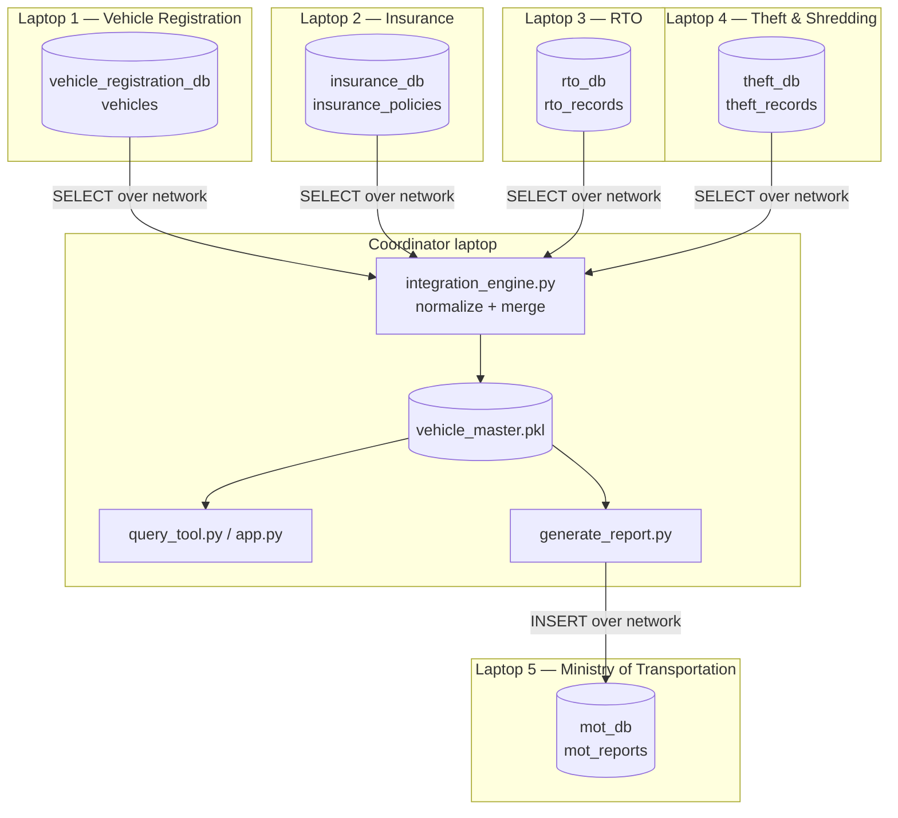

# Uninsured Vehicle Identification System

A distributed data-integration project. Five independent databases — each
modeling a different real-world authority — are reconciled by a single
Coordinator into one decision-ready view, capable of answering
plate-number queries live and automatically reporting flagged vehicles
back to the Ministry of Transportation.

> **Folder layout** (confirmed against the actual repo):
>
> ```
> uninsured_vehicle_project_exact_architecture/     # repo root — run coordinator commands from HERE
> ├── coordinator/                # engine scripts, run on the Coordinator machine
> │   ├── config.py
> │   ├── integration_engine.py
> │   ├── query_tool.py
> │   ├── generate_report.py
> │   └── app.py
> ├── data/                        # ← at the ROOT, sibling of coordinator/
> │   ├── laptop1_vehicle_registration.csv
> │   ├── laptop2_insurance.csv
> │   ├── laptop3_rto.csv
> │   └── laptop4_theft_shredding.csv
> ├── laptop1_registration/       # runs on Laptop 1
> │   ├── schema.sql
> │   ├── coordinator_user.sql
> │   └── generate_data.py
> ├── laptop2_insurance/          # runs on Laptop 2
> │   ├── schema.sql
> │   ├── coordinator_user.sql
> │   └── generate_data.py
> ├── laptop3_rto/                # runs on Laptop 3
> │   ├── schema.sql
> │   ├── coordinator_user.sql
> │   └── generate_data.py
> ├── laptop4_theft/              # runs on Laptop 4
> │   ├── schema.sql
> │   ├── coordinator_user.sql
> │   └── generate_data.py
> ├── laptop5_mot/                # runs on Laptop 5
> │   ├── schema.sql
> │   └── coordinator_user.sql
> ├── .env                         # ← at the ROOT, not inside coordinator/
> ├── .env.example
> ├── .gitignore
> ├── import_real_data.py         # ← at the ROOT, not inside coordinator/
> ├── NETWORK_SETUP.md
> ├── README.md
> └── requirements.txt
> ```
>
> `.env` sits at the repo root and is picked up automatically by
> `python-dotenv`'s `load_dotenv()` even when you run scripts from inside
> `coordinator/` — it walks up parent directories looking for `.env`, so
> one root-level file covers every script regardless of which folder you
> run it from.

---

## 1. Architecture



**Why the sources are "heterogeneous":** each database names the vehicle
identifier column differently on purpose —

| Laptop | Database                  | Table                | Identifier column                        |
| ------ | ------------------------- | -------------------- | ---------------------------------------- |
| 1      | `vehicle_registration_db` | `vehicles`           | `reg_plate`                              |
| 2      | `insurance_db`            | `insurance_policies` | `vehicle_number`                         |
| 3      | `rto_db`                  | `rto_records`        | `car_id`                                 |
| 4      | `theft_db`                | `theft_records`      | `plate_no`                               |
| 5      | `mot_db`                  | `mot_reports`        | `vehicle_plate` (write-only, never read) |

`normalize_plate()` in `integration_engine.py` strips spaces/dashes and
uppercases every raw value into one canonical key (`DL01AB1001`), which is
what every merge and lookup actually joins on.

**Decision layer** (`query_tool.py`), run per vehicle after the merge:

| Priority | Condition                                | Decision                            |
| -------- | ---------------------------------------- | ----------------------------------- |
| 1        | `theft.status == 'stolen'`               | `STOLEN`                            |
| 2        | `theft.status == 'shredded'`             | `SCRAPPED/SHREDDED`                 |
| 3        | no matching insurance row                | `UNINSURED`                         |
| 4        | `policy_end_date < today`                | `INSURANCE EXPIRED`                 |
| 5        | any source was unreachable at build time | `INCONCLUSIVE — SOURCE UNAVAILABLE` |
| 6        | none of the above                        | `OK — INSURED AND CLEAR`            |

A **trust score** (100, minus 20 per unavailable source, minus 5 if theft-flagged) gives a graded confidence measure alongside the decision.

---

## 2. Prerequisites

- Python 3.10+
- MySQL Server on every laptop that hosts a database
- On the Coordinator:
  ```bash
  pip install mysql-connector-python pandas python-dotenv faker flask --break-system-packages
  ```
  (drop `--break-system-packages` on Windows/macOS if pip rejects the flag)

---

## 3. Configure `.env` (Coordinator only)

Create `.env` at the **repo root** (sibling of `coordinator/`, `data/`, and the laptop folders):

```dotenv
VEHICLES_HOST=localhost
INSURANCE_HOST=localhost
RTO_HOST=localhost
THEFT_HOST=localhost
MOT_HOST=localhost

DB_PORT=3306

COORDINATOR_USER=coordinator
COORDINATOR_PASSWORD=ChooseAStrongPassword123!

MYSQL_ROOT_PASSWORD=studentroot
```

- `COORDINATOR_*` — used by `config.py`, `integration_engine.py`, `generate_report.py`, `app.py` to connect as the low-privilege `coordinator` user.
- `MYSQL_ROOT_PASSWORD` — used only by `generate_data.py` / `import_real_data.py`, which need root to seed/replace data directly.
- All `_HOST` values start as `localhost` (Part A). They become real LAN IPs in Part B.

If you don't know your local MySQL root password: try `mysql -u root` (no `-p`) — a fresh install often has none set. If that logs you in:

```sql
ALTER USER 'root'@'localhost' IDENTIFIED BY 'studentroot';
FLUSH PRIVILEGES;
```

---
## Instruction starts from here, virtual venv
```bash
python3 -m venv .venv
source .venv/bin/activate

python -m pip install --upgrade pip

pip install -r requirements.txt
```

## Part A — Local single-machine run (do this first)

Everything below runs against one local MySQL server, validating logic before adding real network complexity.

All commands in this section are run from the **repo root** unless noted.

### A1 — Create all 5 databases and tables

```bash
mysql -u root -p < laptop1_registration/schema.sql
mysql -u root -p < laptop2_insurance/schema.sql
mysql -u root -p < laptop3_rto/schema.sql
mysql -u root -p < laptop4_theft/schema.sql
mysql -u root -p < laptop5_mot/schema.sql
```

### A2 — Create the coordinator user on each database

```bash
mysql -u root -p < laptop1_registration/coordinator_user.sql
mysql -u root -p < laptop2_insurance/coordinator_user.sql
mysql -u root -p < laptop3_rto/coordinator_user.sql
mysql -u root -p < laptop4_theft/coordinator_user.sql
mysql -u root -p < laptop5_mot/coordinator_user.sql
```

### A3 — Load data

**Real data** (repo root — `import_real_data.py` and `data/` are siblings here):

```bash
python3 import_real_data.py vehicles  data/laptop1_vehicle_registration.csv
python3 import_real_data.py insurance data/laptop2_insurance.csv
python3 import_real_data.py rto       data/laptop3_rto.csv
python3 import_real_data.py theft     data/laptop4_theft_shredding.csv
```

This truncates each table first, so real data fully replaces dummy rows. Never run anything against `mot_db` here — it must start and stay empty.

### A4 — Build the integrated master

```bash
cd coordinator
python3 integration_engine.py
```

Pulls all 4 sources over the network, normalizes plate formats, merges, and saves `vehicle_master.pkl` (inside `coordinator/`). Should print a row count and all 4 sources as AVAILABLE. `.env` at the repo root is found automatically even though you're now a folder deeper.

### A5 — Query it

```bash
python3 query_tool.py     # still inside coordinator/
```

Enter a plate number, `refresh` (rebuild fresh), or `quit`.

Optional web UI:

```bash
python3 app.py             # still inside coordinator/
```

then visit `http://localhost:5000`.

### A6 — Generate the compliance report

```bash
python3 generate_report.py   # still inside coordinator/
```

Writes flagged vehicles to `ministry_report.csv` and inserts them into `mot_db.mot_reports` over the network:

```bash
mysql -u root -p -e "USE mot_db; SELECT COUNT(*) FROM mot_reports;"
```

If A1–A6 all work, move to Part B.

---

## Part B — Real distributed deployment (5 laptops + Coordinator)

### B1 — Get every laptop's LAN IP

```bash
# Windows
ipconfig
# macOS
ifconfig | grep inet
# Linux
ip addr show   # or: hostname -I
```

Put every laptop on the same Wi-Fi/hotspot first — a phone hotspot is the most reliable option for a demo, since campus/office Wi-Fi often blocks device-to-device traffic.

### B2 — On each of the 5 DB laptops

1. **Open MySQL to the network.** Linux: edit `/etc/mysql/mysql.conf.d/mysqld.cnf`, set `bind-address = 0.0.0.0`, then `sudo systemctl restart mysql`. Windows/macOS usually already listen on all interfaces.
2. **Copy that laptop's own folder** (e.g. `laptop2_insurance/`, containing its `schema.sql` + `coordinator_user.sql` + `generate_data.py`) to that physical machine, and run both SQL files (A1/A2).
3. **Load its real data.** Copy `import_real_data.py` and the matching CSV from `data/` to that laptop too, then run it locally the same way as A3 — it only needs `mysql.connector`, `pandas`, and `python-dotenv`, so no need to bring the whole repo.
4. **Open port 3306 in the firewall:**
   - Linux: `sudo ufw allow 3306/tcp`
   - Windows: Windows Defender Firewall → Advanced Settings → Inbound Rules → New Rule → Port → TCP 3306 → Allow
   - macOS: System Settings → Network → Firewall → Options → allow incoming connections for `mysqld`

### B3 — On the Coordinator laptop

1. **Update `.env`** with real IPs from B1:

   ```dotenv
   VEHICLES_HOST=192.168.1.11
   INSURANCE_HOST=192.168.1.12
   RTO_HOST=192.168.1.13
   THEFT_HOST=192.168.1.14
   MOT_HOST=192.168.1.15
   ```

   Keep `COORDINATOR_PASSWORD` identical to what's in every laptop's `coordinator_user.sql`.

2. **Test each connection individually first:**

   ```bash
   mysql -h LAPTOP1_IP -u coordinator -p vehicle_registration_db -e "SHOW TABLES;"
   mysql -h LAPTOP2_IP -u coordinator -p insurance_db -e "SHOW TABLES;"
   mysql -h LAPTOP3_IP -u coordinator -p rto_db -e "SHOW TABLES;"
   mysql -h LAPTOP4_IP -u coordinator -p theft_db -e "SHOW TABLES;"
   mysql -h LAPTOP5_IP -u coordinator -p mot_db -e "SHOW TABLES;"
   ```

   Fix any failures here (back to B2) before running anything in Python — `integration_engine.py`'s error handling will otherwise mask which laptop is actually the problem.

3. **Run the exact same commands as Part A4–A6**, now pointed at real IPs — no code changes needed, since `config.py` reads everything from `.env`.

### B4 — Test the failure mode

Kill the Wi-Fi on one DB laptop, then re-run `python3 query_tool.py`. Affected vehicles should show `*_source_available: False` and roll into `INCONCLUSIVE — SOURCE UNAVAILABLE`, not crash the program. This is End-to-End Test #6 from the project guide and proves the system degrades gracefully.

---

## Troubleshooting

| Symptom                                      | Likely cause                                                            | Fix                                                                                                       |
| -------------------------------------------- | ----------------------------------------------------------------------- | --------------------------------------------------------------------------------------------------------- |
| `Access denied for user 'root'@'localhost'`  | `.env` password doesn't match MySQL's actual root password              | `mysql -u root -p`, or `mysql -u root` if blank; then `ALTER USER 'root'@'localhost' IDENTIFIED BY '...'` |
| `Access denied for user 'coordinator'@'IP'`  | `coordinator_user.sql` wasn't run on that laptop, or password mismatch  | Re-run `coordinator_user.sql` on that laptop with the exact password from `.env`                          |
| `Can't connect to MySQL server on 'IP'`      | Firewall blocking 3306, or `bind-address` still `127.0.0.1`             | Recheck B2 steps 1 and 4 on that laptop                                                                   |
| `KeyError: 'key'` in `integration_engine.py` | A down source returned a columnless empty DataFrame that couldn't merge | Use the current fixed version, which checks for the source column instead of `.empty`                     |
| Query tool returns 0 rows for one laptop     | DB/table name typo in `.env` or `schema.sql`                            | Double-check spelling against the `CREATE DATABASE`/`CREATE TABLE` statements                             |
| Same vehicle appears twice after merge       | Plate format not caught by `normalize_plate()`                          | Print the raw values and extend the regex in `normalize_plate()`                                          |
| Flask page won't load from another laptop    | `app.run()` bound to `127.0.0.1`                                        | Confirm `host="0.0.0.0"` in `app.py`, and firewall allows port 5000                                       |

---

## Quick reference

```bash
# --- from repo root ---
# one-time per source DB
mysql -u root -p < <laptopN_folder>/schema.sql
mysql -u root -p < <laptopN_folder>/coordinator_user.sql
python3 <laptopN_folder>/generate_data.py           # dummy data, OR:
python3 import_real_data.py <source> data/<csv>     # real data

# --- from inside coordinator/ ---
python3 integration_engine.py    # whenever underlying data changes
python3 query_tool.py
python3 app.py
python3 generate_report.py
```
